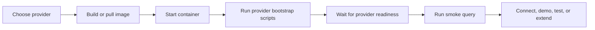

# Database Provider Model

SQLDockerDeployKit standardises a database container lifecycle. It does not try
to hide database dialect differences behind generic SQL.

## Provider Picker

| Choose | When you want | Published image |
| --- | --- | --- |
| SQL Server | The default MoviesDB demo, SQL Server tooling, or backwards-compatible repository behaviour | `ghcr.io/anthonypwatts/sqldockerdeploykit/database-container:main` |
| PostgreSQL | The same demo shape on PostgreSQL, port `5432`, and native PostgreSQL bootstrap behaviour | `ghcr.io/anthonypwatts/sqldockerdeploykit/database-container-postgres:main` |

## Container Lifecycle



Each provider should document and implement:

- image build command;
- container run command;
- credentials and environment variables;
- public port;
- readiness behaviour;
- bootstrap script location;
- smoke-query command;
- cleanup command;
- provider-specific caveats.

## Current Providers

| Provider | Image path | Port | Credentials | Bootstrap scripts | Smoke query |
| --- | --- | --- | --- | --- | --- |
| [SQL Server](../providers/sqlserver/README.md) | `src/Dockerfile` or `providers/sqlserver/Dockerfile` | `1433` | `sa` / `MSSQL_SA_PASSWORD` | `src/SQLScripts/*.sql` | `providers/sqlserver/smoke-query.sql` |
| [PostgreSQL](../providers/postgres/README.md) | `providers/postgres/Dockerfile` | `5432` | `postgres` / `POSTGRES_PASSWORD` | `providers/postgres/scripts/*.sql` | `providers/postgres/smoke-query.sql` |

## SQL Server Baseline

The default SQL Server provider uses `mcr.microsoft.com/mssql/server:2022-latest`.
This keeps the default image on a supported, established major version without
moving consumers to the newer SQL Server 2025 line by surprise.

Use `MSSQL_SA_PASSWORD` for new SQL Server container runs. `SA_PASSWORD` remains
accepted as a backwards-compatible alias for existing local, ARM, or Terraform
usage.

SQL Server startup is managed by `src/entrypoint.sh`. It starts SQL Server,
waits for `SELECT 1` to succeed, then runs the files in `src/SQLScripts` in
filename order. The readiness wait can be adjusted with
`SQL_READY_TIMEOUT_SECONDS` and `SQL_READY_POLL_SECONDS`.

The SQL Server bootstrap path runs on container start. The included demo scripts
are intended for fresh containers; use idempotent scripts or add a first-run
guard before combining this path with persistent storage.

The `providers/sqlserver/Dockerfile` path also adds a Docker `HEALTHCHECK`
against `SELECT 1`. The legacy published `src/Dockerfile` path relies on the
entrypoint readiness check and CI smoke test rather than an image-level
healthcheck.

## PostgreSQL Baseline

The PostgreSQL provider uses `postgres:16`. `POSTGRES_DB` is set to `moviesdb`
and `POSTGRES_USER` is set to `postgres`; callers must provide
`POSTGRES_PASSWORD`.

Bootstrap files are copied into `/docker-entrypoint-initdb.d`, so the official
PostgreSQL entrypoint runs them only when the data directory is first
initialised. The image includes a Docker `HEALTHCHECK` using `pg_isready`.

## Cloud Deployment Templates

The ARM and Terraform templates both support the current providers. SQL Server
remains the default to preserve the original Azure deployment path. PostgreSQL
is selected explicitly with `databaseProvider=postgres` in ARM or
`database_provider=postgres` in Terraform.

| Provider | Cloud image | Public port | Secure password variable | Username | Database |
| --- | --- | --- | --- | --- | --- |
| SQL Server | `ghcr.io/anthonypwatts/sqldockerdeploykit/database-container:main` | `1433` | `MSSQL_SA_PASSWORD` | `sa` | `MoviesDB` |
| PostgreSQL | `ghcr.io/anthonypwatts/sqldockerdeploykit/database-container-postgres:main` | `5432` | `POSTGRES_PASSWORD` | `postgres` | `moviesdb` |

The Terraform variable remains named `sa_password` so existing SQL Server
automation does not break. When PostgreSQL is selected, that value is mapped to
`POSTGRES_PASSWORD`.

The sample Terraform file currently sets `subscription_id` in the AzureRM
provider block. Change that value for your Azure subscription, or remove it if
you prefer Terraform to use the active Azure CLI subscription.

The Azure Container Instances templates are intended for demonstrations,
development, and smoke testing. They expose the database port publicly and do
not configure persistent storage, private networking, TLS, firewall rules, or
backup policy. Treat container group recreation as database recreation unless
you add an explicit persistence design.

## Dialect Boundary

Provider SQL is intentionally separate. SQL Server scripts use T-SQL features
such as `GO`, `USE`, `PRINT`, `IDENTITY`, `NVARCHAR`, and `MERGE`. PostgreSQL
uses its own database creation flow, identity syntax, lowercase object names,
and `ON CONFLICT`.

The shared contract is observable setup behaviour, not byte-for-byte SQL
compatibility:

- the container starts;
- readiness can be checked;
- bootstrap scripts run in deterministic order;
- the Movies demo data is present;
- a smoke query returns row counts for the expected tables.

CI runs `scripts/smoke-test-provider.sh` for pull requests and pushes. The smoke
test starts the image, runs the provider's smoke query, and asserts the expected
`5:5:5` Movies demo row counts.

The workflow covers:

- the legacy `src/Dockerfile`, published as
  `ghcr.io/anthonypwatts/sqldockerdeploykit/database-container:main`;
- the provider-layout SQL Server Dockerfile, smoke-tested but not published;
- the PostgreSQL provider Dockerfile, published as
  `ghcr.io/anthonypwatts/sqldockerdeploykit/database-container-postgres:main`.

You can run the same smoke helper locally after building an image:

```shell
bash scripts/smoke-test-provider.sh sqlserver sqldockerdeploykit
bash scripts/smoke-test-provider.sh postgres sqldockerdeploykit-postgres
```

The helper accepts `SQLDDK_SMOKE_PASSWORD`, `SQLDDK_SMOKE_TIMEOUT_SECONDS`, and
`SQLDDK_SMOKE_POLL_SECONDS` environment variables when defaults are unsuitable.

## Adding Another Provider

Add a new folder under `providers/<engine>` with the provider's Dockerfile,
bootstrap scripts, smoke query, README, readiness behaviour, and cleanup notes.
Keep the SQL dialect native to that engine, and update this document plus the CI
image matrix when the provider is ready to build.

Avoid adding a cross-provider SQL abstraction unless the project has a real
consumer need for it. The first portability goal is repeatable container setup,
not identical SQL commands.
