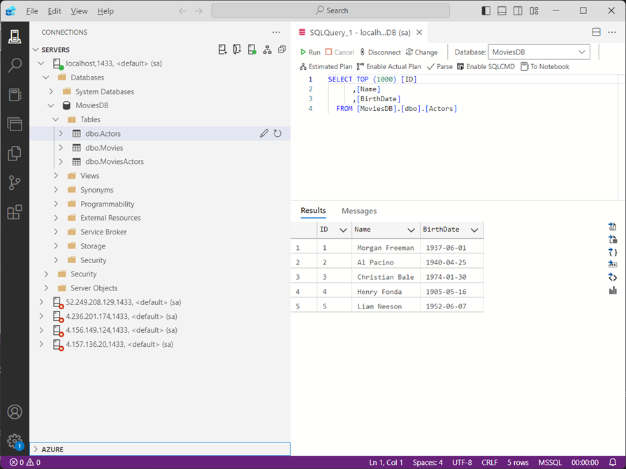

# SQLDockerDeployKit Project

## Description
A versatile tool for deploying SQL Server databases in Docker containers. Ideal for rapid setup of database environments for development, testing, and demonstrations.

## Quicklinks
### ARM Quick Deploy
[](https://portal.azure.com/#create/Microsoft.Template/uri/https%3A%2F%2Fraw.githubusercontent.com%2FAnthonyPWatts%2FSQLDockerDeployKit%2Fmain%2Fsrc%2Fazure-resource-manager-template.json)

### GCR Image
 [GitHub Container Registry Image](https://github.com/AnthonyPWatts?tab=packages&repo_name=SQLDockerDeployKit)

## Overview
SQLDockerDeployKit is a tool designed to streamline the setup and deployment of SQL Server databases within Docker containers, catering to use cases from development and testing to live demonstrations. 

Whether you are a developer, a database administrator, or a student learning SQL Server, SQLDockerDeployKit offers a quick and easy way to get your database up and running with minimal setup, even to the cloud.

### Key Features and Advantages
- Ease of Use: With a focus on simplicity, SQLDockerDeployKit allows for the quick provisioning of SQL Server instances, eliminating the complexities traditionally associated with database setup.
- Flexibility: The tool supports multiple deployment options, including local Docker environments and cloud-based solutions like Azure. This flexibility ensures that users can select the deployment method that best suits their needs.
- Customisation: Users can easily adapt the tool to deploy different database schemas and utilise automated SQL scripts for database initialisation.
- Rapid Development and Testing: The tool is an excellent asset for developers and QA engineers looking for a fast way to spin up SQL Server instances for application development, testing, or bug reproduction.

### Intended Users
- Software Developers: Quickly integrate and test database interactions with your applications without the overhead of complex database setup procedures.
- Database Administrators and DBA Students: Learn and experiment with SQL Server configurations, performance tuning, and security settings in a controlled, easily resettable environment.
- Demo and Training Providers: Create consistent, reproducible database environments for training sessions, workshops, or product demonstrations, ensuring that all participants have a uniform starting point.

### Use Cases
- Application Development: Streamline the development process by quickly setting up and tearing down database environments, allowing more time to focus on application logic and user experience.
- Testing Environments: Easily create and duplicate test databases to isolate test cases, ensuring accurate and reliable results.
- Educational Purposes: Provide students with a simple way to access and manage SQL Server databases, facilitating hands-on learning and experimentation.
- Demo Environments: Showcase software products or data-driven applications in a stable, controlled environment, enhancing the impact of your presentations.

SQLDockerDeployKit users can significantly reduce the time and effort required to provision SQL Server databases, allowing them to focus on their core activities, whether it be development, testing, learning, or showcasing products.


### GitHub Repository Features
Any commits to the main branch trigger an update of this project's [GitHub Container Registry Image](https://github.com/AnthonyPWatts?tab=packages&repo_name=SQLDockerDeployKit).


## Deployment Options
### Option 1 - Quick Start with Docker
####  (if you want to work with the unchanged example MoviesDB, running locally)
Pull the image from the GitHub Container Registry:
```shell 
docker pull ghcr.io/anthonypwatts/sqldockerdeploykit/database-container:main
```

Start the Docker container in detached mode (-d) and map port 1433 from the container to port 1433 on the host machine, allowing SQL Server connections:
```shell
docker run -d -p 1433:1433 ghcr.io/anthonypwatts/sqldockerdeploykit/database-container:main
```


### Option 2 - Quick Deploy to Azure with ARM Template
####  (if you want to work with the unchanged MoviesDB, running in the cloud)
Deploy the latest build of this project's image (as generated in the CI/CD pipeline and deployed to GitHub Container Registry) to Azure Container Instances using the Azure Resource Manager (ARM) template. The template is configured to set up the environment with reasonable default configurations and ports.

Click the "Deploy to Azure" button below. You'll be redirected to the Azure portal.

Fill in the necessary parameters and deploy.

[](https://portal.azure.com/#create/Microsoft.Template/uri/https%3A%2F%2Fraw.githubusercontent.com%2FAnthonyPWatts%2FSQLDockerDeployKit%2Fmain%2Fsrc%2Fazure-resource-manager-template.json)

---

### Option 3 - 'Quick' Deploy with Terraform
#### (if you want to deploy using Terraform for infrastructure as code.)
Before deploying with Terraform, ensure you are authenticated with Azure:

1. Log in to your Azure account:
    ```shell
    az login
    ```

2. Set the desired subscription (if you have multiple subscriptions):
    ```shell
    az account set --subscription "<YourSubscriptionID>"
    ```

3. Verify that you are authenticated and the correct subscription is selected:
    ```shell
    az account show
    ```

Once authenticated, proceed with the Terraform steps outlined below.
1. Ensure you have [Terraform installed](https://developer.hashicorp.com/terraform/downloads) on your system.
2. Navigate to the `src` folder where the `main.tf` file is located.
3. Initialize Terraform to download the required providers:
   ```shell
   terraform init
   ```
4. Review the execution plan to ensure the resources will be created as expected:
   ```shell
   terraform plan
   ```
5. Apply the Terraform configuration to deploy the resources:
   ```shell
   terraform apply
   ```
   Confirm the prompt with `yes` to proceed with the deployment.

Once the deployment is complete, Terraform will output the public DNS name of the container group. Use this DNS name to connect to the SQL Server instance.

Example connection details:
- Server: `<DNS_NAME>:1433`
- Authentication: SQL Server Authentication
- Username: `sa`
- Password: `<YourStrong!Passw0rd>` (or the password you configured in the Docker image).

---

## Extending and Customising SQLDockerDeployKit
For customisation or development:
1. Fork or clone this repository as appropriate.
2. If forked, change the sa password used in `Dockerfile` and in `entrypoint.sh`.
3. Amend the SQL in src/SQLScripts as required. Note that the scripts are executed sequentially, so follow the 001, 002, 003 pattern.
4. Build the Docker image from the src folder (you can replace 'sqldockerdeploykit' with your preferred image name): 
```shell
docker build -t sqldockerdeploykit .
```
5. Run the Docker container: 
```shell
docker run --name myDatabaseContainer -d -p 1433:1433 sqldockerdeploykit
```
6. Use or amend the provided IaC (infrastructure as code, e.g. ARM, Terraform) templates for easy cloud deployments.

---

## Connecting to the Database
Connect to the SQL Server instance using tools like Azure Data Studio (soon to be retired/incorporated into VSCode) or SQL Server Management Studio:
- Server: e.g., `localhost,1433`
- Authentication: SQL Server Authentication
- Username: `sa`
- Password: [Your sa password] or if unchanged the image default is: `<YourStrong!Passw0rd>`



### TIP: Changing the SA Password:
General instructions for changing the SA password on SQL Server:
1. Connect to your SQL Server instance using SQL Server Management Studio or another SQL client. (the default password is: `<YourStrong!Passw0rd>`)
2. Once connected, open a new query window.
3. Run the following SQL command:
    `ALTER LOGIN sa WITH PASSWORD = 'YourNewStrongPassword!';`
    (Replace `YourNewStrongPassword!` with your desired new password. Ensure your new password adheres to SQL Server's password policy for security)
4. Execute the query to update the password.

---

## Contributing
Contributions to the SQLDockerDeployKit project are welcome. Please fork the repository and submit a pull request with your changes.

## License

This project is released into the public domain. Anyone is free to copy, modify, publish, use, compile, sell, or distribute this software, for any purpose, commercial or non-commercial, and by any means. There are no restrictions. Use it as you see fit.


## Contact
Tony Watts - anthonypwatts@gmail.com
