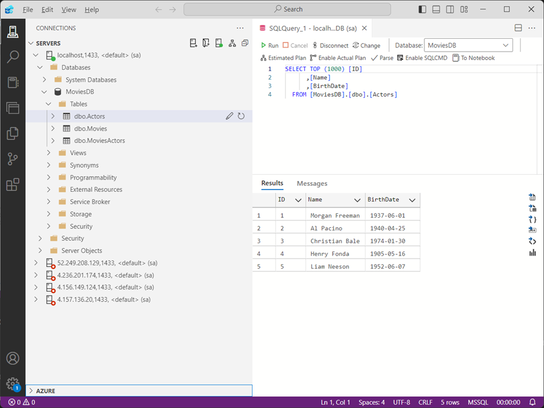

# SQLDockerDeployKit Project

## Description
A small database-container deployment kit. The original and default path deploys SQL Server databases in Docker containers; the provider layout also includes PostgreSQL as the first additional engine. Ideal for rapid setup of database environments for development, testing, and demonstrations.

## Quicklinks
### ARM Quick Deploy
[](https://portal.azure.com/#create/Microsoft.Template/uri/https%3A%2F%2Fraw.githubusercontent.com%2FAnthonyPWatts%2FSQLDockerDeployKit%2Fmain%2Fsrc%2Fazure-resource-manager-template.json)

### GHCR Images
- [Default SQL Server image](https://github.com/AnthonyPWatts?tab=packages&repo_name=SQLDockerDeployKit)
- PostgreSQL image: `ghcr.io/anthonypwatts/sqldockerdeploykit/database-container-postgres:main`

## Overview
SQLDockerDeployKit is a tool designed to streamline the setup and deployment of database containers, catering to use cases from development and testing to live demonstrations. SQL Server 2022 is the default provider baseline and existing SQL Server usage is preserved. PostgreSQL is available as a provider-specific template.

The project standardises the container lifecycle rather than pretending all database SQL is portable. Provider-specific SQL, credentials, ports, readiness checks, and smoke queries are documented separately in [docs/providers.md](docs/providers.md).

Whether you are a developer, a database administrator, or a student learning relational databases, SQLDockerDeployKit offers a quick and easy way to get your database up and running with minimal setup.

### Key Features and Advantages
- Ease of Use: With a focus on simplicity, SQLDockerDeployKit allows for the quick provisioning of database containers, eliminating the complexities traditionally associated with database setup.
- Flexibility: The tool supports multiple deployment options, including local Docker environments and cloud-based solutions like Azure. This flexibility ensures that users can select the deployment method that best suits their needs.
- Customisation: Users can easily adapt the tool to deploy different database schemas and utilise automated SQL scripts for database initialisation.
- Rapid Development and Testing: The tool is an excellent asset for developers and QA engineers looking for a fast way to spin up SQL Server instances for application development, testing, or bug reproduction.

### Intended Users
- Software Developers: Quickly integrate and test database interactions with your applications without the overhead of complex database setup procedures.
- Database Administrators and DBA Students: Learn and experiment with SQL Server configurations, performance tuning, and security settings in a controlled, easily resettable environment.
- Demo and Training Providers: Create consistent, reproducible database environments for training sessions, workshops, or product demonstrations, ensuring that all participants have a uniform starting point.

### Use Cases
- Application Development: Streamline the development process by quickly setting up and tearing down database environments, allowing more time to focus on application logic and user experience.
- Testing Environments: Easily create and duplicate test databases to isolate test cases, ensuring accurate and reliable results.
- Educational Purposes: Provide students with a simple way to access and manage SQL Server databases, facilitating hands-on learning and experimentation.
- Demo Environments: Showcase software products or data-driven applications in a stable, controlled environment, enhancing the impact of your presentations.

SQLDockerDeployKit users can significantly reduce the time and effort required to provision database containers, allowing them to focus on their core activities, whether it be development, testing, learning, or showcasing products.


### GitHub Repository Features
Any commits to the main branch trigger smoke-tested updates for this project's configured [GitHub Container Registry images](https://github.com/AnthonyPWatts?tab=packages&repo_name=SQLDockerDeployKit).


## Deployment Options
### Option 1 - Quick Start with Docker
#### SQL Server, default provider
If you want to work with the unchanged example MoviesDB locally, pull the default SQL Server image from the GitHub Container Registry:
```shell 
docker pull ghcr.io/anthonypwatts/sqldockerdeploykit/database-container:main
```

Start the Docker container in detached mode (-d) and map port 1433 from the container to port 1433 on the host machine, allowing SQL Server connections:
```shell
docker run -d -p 1433:1433 -e "MSSQL_SA_PASSWORD=YourStrong!Passw0rd" ghcr.io/anthonypwatts/sqldockerdeploykit/database-container:main
```

Run the SQL Server smoke query:

```shell
docker exec <container-name-or-id> bash -lc 'sqlcmd -C -S localhost -U SA -P "YourStrong!Passw0rd" -i /tmp/app/provider/smoke-query.sql'
```

#### PostgreSQL provider
Build and run the PostgreSQL provider locally:

```shell
docker build -t sqldockerdeploykit-postgres -f providers/postgres/Dockerfile .
docker run --name sqldockerdeploykit-postgres -d -p 5432:5432 -e "POSTGRES_PASSWORD=YourStrong!Passw0rd" sqldockerdeploykit-postgres
```

Run the PostgreSQL smoke query:

```shell
docker exec sqldockerdeploykit-postgres psql -U postgres -d moviesdb -f /usr/local/share/sqldockerdeploykit/smoke-query.sql
```


### Option 2 - Quick Deploy to Azure with ARM Template
#### SQL Server, default provider
Deploy the latest build of the default SQL Server image (as generated in the CI/CD pipeline and deployed to GitHub Container Registry) to Azure Container Instances using the Azure Resource Manager (ARM) template. The template is configured to set up the environment with reasonable default configurations and ports, and prompts for the SQL Server System Administrator password.

Click the "Deploy to Azure" button below. You'll be redirected to the Azure portal.

Fill in the necessary parameters and deploy.

[](https://portal.azure.com/#create/Microsoft.Template/uri/https%3A%2F%2Fraw.githubusercontent.com%2FAnthonyPWatts%2FSQLDockerDeployKit%2Fmain%2Fsrc%2Fazure-resource-manager-template.json)

---

### Option 3 - 'Quick' Deploy with Terraform
#### SQL Server, default provider
If you want to deploy the default SQL Server provider using Terraform for infrastructure as code, first ensure you are authenticated with Azure.

1. Log in to your Azure account:
    ```shell
    az login
    ```

2. Set the desired subscription (if you have multiple subscriptions):
    ```shell
    az account set --subscription "<YourSubscriptionID>"
    ```

3. Verify that you are authenticated and the correct subscription is selected:
    ```shell
    az account show
    ```

Once authenticated, proceed with the Terraform steps outlined below.
1. Ensure you have [Terraform installed](https://developer.hashicorp.com/terraform/downloads) on your system.
2. Navigate to the `src` folder where the `main.tf` file is located.
3. Initialise Terraform to download the required providers:
   ```shell
   terraform init
   ```
4. Review the execution plan to ensure the resources will be created as expected:
   ```shell
   terraform plan -var "sa_password=YourStrong!Passw0rd"
   ```
5. Apply the Terraform configuration to deploy the resources:
   ```shell
   terraform apply -var "sa_password=YourStrong!Passw0rd"
   ```
   Confirm the prompt with `yes` to proceed with the deployment.

Once the deployment is complete, Terraform will output the public DNS name of the container group. Use this DNS name to connect to the SQL Server instance.

Example connection details:
- Server: `<DNS_NAME>:1433`
- Authentication: SQL Server Authentication
- Username: `sa`
- Password: the `sa_password` value supplied to Terraform.

---

## Extending and Customising SQLDockerDeployKit
For customisation or development:
1. Fork or clone this repository as appropriate.
2. Choose the provider you want to customise. SQL Server remains under `src` for backwards compatibility; PostgreSQL lives under `providers/postgres`.
3. Amend the provider's SQL scripts as required. Scripts are executed sequentially, so follow the `001`, `002`, `003` filename pattern.
4. Build the Docker image from the repository root. For SQL Server:
```shell
docker build -t sqldockerdeploykit -f src/Dockerfile .
```
5. Run the Docker container:
```shell
docker run --name myDatabaseContainer -d -p 1433:1433 -e "MSSQL_SA_PASSWORD=YourStrong!Passw0rd" sqldockerdeploykit
```
6. For SQL Server, `MSSQL_SA_PASSWORD` is the preferred password environment variable. `SA_PASSWORD` remains accepted as a backwards-compatible alias.
7. For PostgreSQL, build with `providers/postgres/Dockerfile` and use `POSTGRES_PASSWORD` plus port `5432`.
8. Use or amend the provided IaC (infrastructure as code, e.g. ARM, Terraform) templates for SQL Server cloud deployments. PostgreSQL cloud deployment templates are not included yet.

---

## Connecting to the Database
Connect to the SQL Server instance using tools like Azure Data Studio (soon to be retired/incorporated into VSCode) or SQL Server Management Studio:
- Server: e.g., `localhost,1433`
- Authentication: SQL Server Authentication
- Username: `sa`
- Password: the `MSSQL_SA_PASSWORD` value supplied when the container was started.



### TIP: Changing the SA Password:
General instructions for changing the SA password on SQL Server:
1. Connect to your SQL Server instance using SQL Server Management Studio or another SQL client.
2. Once connected, open a new query window.
3. Run the following SQL command:
    `ALTER LOGIN sa WITH PASSWORD = 'YourNewStrongPassword!';`
    (Replace `YourNewStrongPassword!` with your desired new password. Ensure your new password adheres to SQL Server's password policy for security)
4. Execute the query to update the password.

---

## Contributing
Contributions to the SQLDockerDeployKit project are welcome. Please fork the repository and submit a pull request with your changes.

## Licence

This project is released into the public domain. Anyone is free to copy, modify, publish, use, compile, sell, or distribute this software, for any purpose, commercial or non-commercial, and by any means. There are no restrictions. Use it as you see fit.
