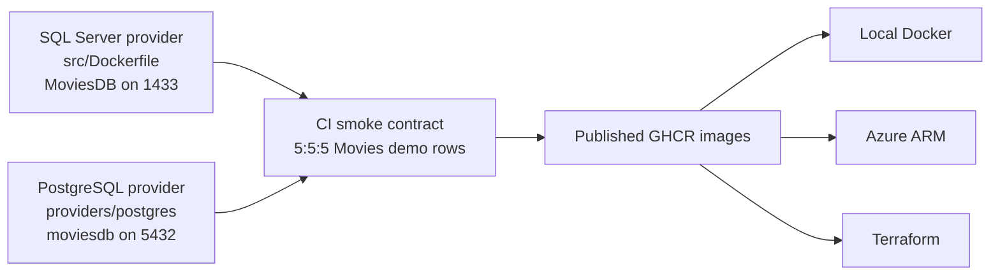

# SQLDockerDeployKit

[](https://github.com/AnthonyPWatts/SQLDockerDeployKit/actions/workflows/docker_ci_cd.yml)


[](#licence)

Smoke-tested database containers for repeatable local, demo, training, and
Azure Container Instances environments. SQL Server 2022 is the default provider
for continuity with the original project; PostgreSQL is available through the
provider layout for teams that need a second engine.

The kit standardises the container lifecycle: build an image, start a database,
run bootstrap scripts, wait for readiness, and prove the Movies demo data is
queryable. It does not pretend SQL dialects are portable. Provider-specific SQL,
credentials, ports, readiness checks, and smoke queries are documented in
[docs/providers.md](docs/providers.md).

## Choose Your Path

| If you need... | Start here | Result |
| --- | --- | --- |
| A local SQL Server demo database | [Quick Start with Docker](#option-1---quick-start-with-docker) | `MoviesDB` on `localhost,1433` |
| A local PostgreSQL demo database | [PostgreSQL provider](#postgresql-provider) | `moviesdb` on `localhost:5432` |
| A one-click Azure demo | [ARM Quick Deploy](#option-2---quick-deploy-to-azure-with-arm-template) | Azure Container Instances with the selected provider |
| Repeatable Azure infrastructure | [Terraform deployment](#option-3---quick-deploy-with-terraform) | Provider-aware ACI deployment outputs |
| Provider internals | [Database Provider Model](docs/providers.md) | Build, smoke-test, and extension details |

## Quicklinks

[](https://portal.azure.com/#create/Microsoft.Template/uri/https%3A%2F%2Fraw.githubusercontent.com%2FAnthonyPWatts%2FSQLDockerDeployKit%2Fmain%2Fsrc%2Fazure-resource-manager-template.json)

| Image | Provider | Published tag |
| --- | --- | --- |
| `database-container` | SQL Server | `ghcr.io/anthonypwatts/sqldockerdeploykit/database-container:main` |
| `database-container-postgres` | PostgreSQL | `ghcr.io/anthonypwatts/sqldockerdeploykit/database-container-postgres:main` |

Browse the [GitHub Container Registry package list](https://github.com/AnthonyPWatts?tab=packages&repo_name=SQLDockerDeployKit)
for published image metadata.

## How It Fits Together


```mermaid
flowchart LR
    sqlserver["SQL Server provider<br/>src/Dockerfile<br/>MoviesDB on 1433"]
    postgres["PostgreSQL provider<br/>providers/postgres<br/>moviesdb on 5432"]
    smoke["CI smoke contract<br/>5:5:5 Movies demo rows"]
    ghcr["Published GHCR images"]
    docker["Local Docker"]
    arm["Azure ARM"]
    terraform["Terraform"]

    sqlserver --> smoke
    postgres --> smoke
    smoke --> ghcr
    ghcr --> docker
    ghcr --> arm
    ghcr --> terraform
```

## What Is Included

- Ready-to-run SQL Server and PostgreSQL demo images.
- Provider-specific bootstrap scripts, smoke queries, ports, and credentials.
- ARM and Terraform templates for Azure Container Instances demos.
- CI that builds and smoke-tests provider images before publishing from `main`.
- A provider model that keeps SQL dialect differences explicit and maintainable.

## Deployment Options
### Option 1 - Quick Start with Docker
#### SQL Server, default provider
If you want to work with the unchanged example MoviesDB locally, pull the default SQL Server image from the GitHub Container Registry:
```shell
docker pull ghcr.io/anthonypwatts/sqldockerdeploykit/database-container:main
```

Start the Docker container in detached mode (-d) and map port 1433 from the container to port 1433 on the host machine, allowing SQL Server connections:
```shell
docker run --name sqldockerdeploykit-sqlserver -d -p 1433:1433 -e "MSSQL_SA_PASSWORD=YourStrong!Passw0rd" ghcr.io/anthonypwatts/sqldockerdeploykit/database-container:main
```

Run the SQL Server smoke query:

```shell
docker exec sqldockerdeploykit-sqlserver bash -lc 'sqlcmd -C -S localhost -U SA -P "YourStrong!Passw0rd" -i /tmp/app/provider/smoke-query.sql'
```

#### PostgreSQL provider
If you want the published PostgreSQL MoviesDB image, pull and run the PostgreSQL provider from the GitHub Container Registry:

```shell
docker pull ghcr.io/anthonypwatts/sqldockerdeploykit/database-container-postgres:main
docker run --name sqldockerdeploykit-postgres -d -p 5432:5432 -e "POSTGRES_PASSWORD=YourStrong!Passw0rd" ghcr.io/anthonypwatts/sqldockerdeploykit/database-container-postgres:main
```

Alternatively, for provider development, build and run the PostgreSQL image locally from the repository root:

```shell
docker build -t sqldockerdeploykit-postgres -f providers/postgres/Dockerfile .
docker run --name sqldockerdeploykit-postgres -d -p 5432:5432 -e "POSTGRES_PASSWORD=YourStrong!Passw0rd" sqldockerdeploykit-postgres
```

Run the PostgreSQL smoke query:

```shell
docker exec sqldockerdeploykit-postgres psql -U postgres -d moviesdb -f /usr/local/share/sqldockerdeploykit/smoke-query.sql
```


### Option 2 - Quick Deploy to Azure with ARM Template
The ARM template deploys the selected provider image to Azure Container
Instances. SQL Server remains the default provider so existing one-click
deployments continue to use the original SQL Server image, port, and
`MSSQL_SA_PASSWORD` setting.

Click the "Deploy to Azure" button below. You'll be redirected to the Azure portal.

Fill in the necessary parameters and deploy.

- For SQL Server, leave `databaseProvider` as `sqlserver`, then provide the
  `saPassword` value. The template exposes port `1433` and sets
  `MSSQL_SA_PASSWORD`.
- For PostgreSQL, set `databaseProvider` to `postgres`, then provide the
  `saPassword` value. The template exposes port `5432` and maps the password to
  `POSTGRES_PASSWORD` for the `postgres` account.

[](https://portal.azure.com/#create/Microsoft.Template/uri/https%3A%2F%2Fraw.githubusercontent.com%2FAnthonyPWatts%2FSQLDockerDeployKit%2Fmain%2Fsrc%2Fazure-resource-manager-template.json)

Azure Container Instances caveat: this template is intended for demos,
development, and smoke testing. It exposes the database port publicly and does
not configure persistent storage, private networking, TLS, firewall rules, or
backup policy. Recreating the container group recreates the database container.

---

### Option 3 - 'Quick' Deploy with Terraform
If you want to deploy a provider using Terraform for infrastructure as code,
first ensure you are authenticated with Azure.

1. Log in to your Azure account:
    ```shell
    az login
    ```

2. Set the desired subscription (if you have multiple subscriptions):
    ```shell
    az account set --subscription "<YourSubscriptionID>"
    ```

3. Verify that you are authenticated and the correct subscription is selected:
    ```shell
    az account show
    ```

   If the browser login flow is awkward in a terminal-only session, use `az login --use-device-code` instead.

Once authenticated, proceed with the Terraform steps outlined below.
1. Ensure you have [Terraform installed](https://developer.hashicorp.com/terraform/downloads) on your system.
2. Navigate to the `src` folder where the `main.tf` file is located.
3. Check the `subscription_id` value in `src/main.tf`. Change it to the subscription you want to use, or remove the line to rely on the active Azure CLI subscription.
4. Initialise Terraform to download the required providers:
   ```shell
   terraform init
   ```
5. Review the execution plan to ensure the resources will be created as expected.
   SQL Server is the default provider:
   ```shell
   terraform plan -var "sa_password=YourStrong!Passw0rd"
   ```
   To deploy PostgreSQL instead, set `database_provider`:
   ```shell
   terraform plan -var "database_provider=postgres" -var "sa_password=YourStrong!Passw0rd"
   ```
   The `sa_password` variable name is retained for SQL Server compatibility. For
   PostgreSQL deployments it supplies `POSTGRES_PASSWORD` for the `postgres`
   account.
6. Apply the Terraform configuration to deploy the resources. For SQL Server:
   ```shell
   terraform apply -var "sa_password=YourStrong!Passw0rd"
   ```
   For PostgreSQL:
   ```shell
   terraform apply -var "database_provider=postgres" -var "sa_password=YourStrong!Passw0rd"
   ```
   Confirm the prompt with `yes` to proceed with the deployment.

Once the deployment is complete, Terraform outputs the selected provider, public
DNS name, endpoint, database name, and administrator username.

Example SQL Server connection details:
- Server: `<DNS_NAME>:1433`
- Authentication: SQL Server Authentication
- Username: `sa`
- Database: `MoviesDB`
- Password: the `sa_password` value supplied to Terraform.

Example PostgreSQL connection details:
- Server: `<DNS_NAME>`
- Port: `5432`
- Database: `moviesdb`
- Username: `postgres`
- Password: the `sa_password` value supplied to Terraform.

The Terraform template has the same Azure Container Instances caveat as the ARM
template: it is a public, non-durable demo/test deployment rather than a
production database architecture.

---

## Extending and Customising SQLDockerDeployKit
For customisation or development:
1. Fork or clone this repository as appropriate.
2. Choose the provider you want to customise. SQL Server remains under `src` for backwards compatibility and is also represented under `providers/sqlserver`; PostgreSQL lives under `providers/postgres`.
3. Amend the provider's SQL scripts as required. Follow the `001`, `002`, `003` filename pattern. SQL Server scripts are executed by `src/entrypoint.sh` on each container start, so keep them idempotent or use fresh containers. PostgreSQL scripts are executed by the official PostgreSQL entrypoint when the data directory is first initialised.
4. Build the Docker image from the repository root. For SQL Server:
```shell
docker build -t sqldockerdeploykit -f src/Dockerfile .
```
5. Run the Docker container:
```shell
docker run --name myDatabaseContainer -d -p 1433:1433 -e "MSSQL_SA_PASSWORD=YourStrong!Passw0rd" sqldockerdeploykit
```
6. For SQL Server, `MSSQL_SA_PASSWORD` is the preferred password environment variable. `SA_PASSWORD` remains accepted as a backwards-compatible alias.
7. For PostgreSQL, build with `providers/postgres/Dockerfile` and use `POSTGRES_PASSWORD` plus port `5432`.
8. Use or amend the provided IaC (infrastructure as code, e.g. ARM, Terraform) templates for SQL Server or PostgreSQL cloud deployments.
9. Run the CI-style smoke test before publishing or sharing a changed image:
```shell
bash scripts/smoke-test-provider.sh sqlserver sqldockerdeploykit
bash scripts/smoke-test-provider.sh postgres sqldockerdeploykit-postgres
```

---

## Connecting to the Database
### SQL Server
Connect to the default SQL Server instance using tools like SQL Server Management Studio, Azure Data Studio where available, or suitable VS Code SQL tooling:
- Server: e.g., `localhost,1433`
- Authentication: SQL Server Authentication
- Username: `sa`
- Password: the `MSSQL_SA_PASSWORD` value supplied when the container was started.


### PostgreSQL
Connect to the local PostgreSQL provider using a PostgreSQL client such as `psql`:
- Server: e.g., `localhost`
- Port: `5432`
- Database: `moviesdb`
- Username: `postgres`
- Password: the `POSTGRES_PASSWORD` value supplied when the container was started.

### SQL Server: Changing the SA Password
General instructions for changing the SA password on SQL Server:
1. Connect to your SQL Server instance using SQL Server Management Studio or another SQL client.
2. Once connected, open a new query window.
3. Run the following SQL command:
    `ALTER LOGIN sa WITH PASSWORD = 'YourNewStrongPassword!';`
    (Replace `YourNewStrongPassword!` with your desired new password. Ensure your new password adheres to SQL Server's password policy for security)
4. Execute the query to update the password.

---

## Contributing
Contributions to the SQLDockerDeployKit project are welcome. Please fork the repository and submit a pull request with your changes.

## Licence

This project is released into the public domain. Anyone is free to copy, modify, publish, use, compile, sell, or distribute this software, for any purpose, commercial or non-commercial, and by any means. There are no restrictions. Use it as you see fit.
